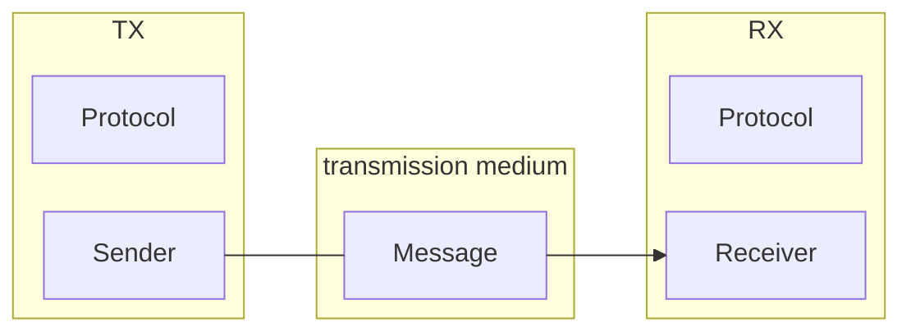

# Introduction

## Data Communications

Communication is essentially the movement of information,
where it can be local (within a system) or remote (between systems).

In extension, data communications is defined as: 

> ... the exchange of data between two devices via some form of transmission media.

So, in a communicating system, there must be at least two devices,
and a (physical) way to transport information between the devices.

### Components

Two devices and a medium is an informal way to describe
the components of a data communications system.
Formally, there are five components in a data communications system.

1. **Sender**: sends the message
2. **Receiver**: receives the message
3. **Medium**: the (physical) path the message need to travel on to go from the sender to the receiver.
4. **Message**: the data
5. **Protocol**: a set of rules that both the sender and receiver agree to in order to
                 properly understand messages between communicating devices.

<figure style="height:100%; width:100%;">

<caption>
    Components of a data communications system.
</caption>
</figure>

### Data Flow
There are three kinds of communication between two devices, namely *simplex*, *half-duplex*, and *duplex*.

1. **Simplex**: Data only goes in one direction (e.g. a mainframe to a monitor, keyboard to a computer).
                This uses the entire capacity of the medium to send the data. This is similar to a one-way street.

    <figure style="height:100%; width:100%">
    ```mermaid
    flowchart LR
        D1[Device 1] -- "direction of data" --> D2[Device 2]

    ```
    </figure>

2. **Half-duplex**: Data goes in two directions, but the entire capacity of the medium is used to send data.
                    To avoid destructive interference or errors, only one direction is available at a time.
                    Continuing the traffic analogy, this happens in a two-way street where one lane is blocked,
                    and only one direction of traffic is available at a time.

    <figure style="height:100%; width:100%">
    ```mermaid
    flowchart LR
        D1[Device 1] -- "direction at time 1" --> D2[Device 2]
        D2 -- "direction at time 2" --> D1

    ```
    </figure>
3. **Full-duplex**: Data goes in both directions at all times. 
                    This is done by allocating a portion for one direction, and the rest for the other.
                    Just like a full-on two-way street.

    <figure style="height:100%; width:100%">
    ```mermaid
    flowchart LR
        D1[Device 1] <-- "direction at all times" --> D2[Device 2]
    ```
    </figure>

!!! warning "Allocation"
    
    In a full-duplex, allocation is not always 50-50.

## Networks
A network is a connected graph of communicating devices.
It must have a set of devices, and these devices must be able to communicate.
In this definition, a device can be a:

* **host**: something that receives and processes the data such as a desktop, phone, etc.
* **connecting device**: something that routes and/or transforms information from one interface
                         to another.

or both!

### Criteria

A network is evaluated through several criteria.
Networks must meet a certain number of them.
The most important ones are:

* **Performance**: 
* **Reliability**:
* **Security**:

### Types

There are two types of connection.

* **Point-to-point**: Direct connection between two devices.
                      The connection's capacity is used to transmit data between them.
* **Multi-point**: Multiple devices share a single link,
                   and the link's capacity is shared among the devices.
                   This means there is a single point of failure for the link.

### Physical Topology

The physical topology is the structure of the network,
specifically, in what arrangement(s) should our set of devices be connected?

!!! note "Factors in choosing a topology"
    
    When creating a network topology, we consider two things:

    * purpose of the network 
    * cost

    Also, networks do not need to have a single topology.
    We can combine them according to our needs and budget.

#### Fully-connected Mesh

Analogous to a [complete graph](https://en.wikipedia.org/wiki/Complete_graph){:target="_blank"} in Mathematics.
Every device has a direct (point-to-point) connection with all the other devices.
In this topology, $n$ nodes have $\frac{n(n-1)}{2}$ **full-duplex** links.

<figure markdown>
| advantages | disadvantages |
| ---------- | ------------- |
| dedicated links | expensive due to cabling and I/O ports needed to implement | 
| robust | |
| private and secure | |
| easy fault identification and isolation | | 
</figure>

#### Star 
#### Bus
#### Ring
